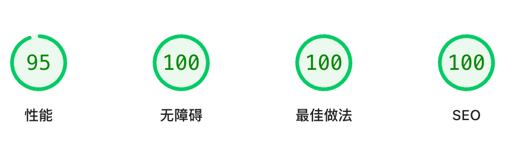
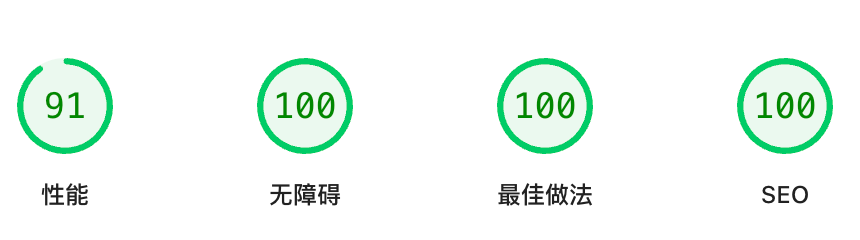

<p align="center">
  
</p>

<h1 align="center">LandingPage</h1>

<p align="center">
  <strong>A modern, minimalist personal landing page theme built with Astro 5, React 19 and Tailwind CSS</strong>
</p>

<p align="center">
  <a href="https://github.com/Vncntvx/LandingPage/blob/main/LICENSE">
    
  </a>
  <a href="https://astro.build/">
    
  </a>
  <a href="https://react.dev/">
    
  </a>
  <a href="https://tailwindcss.com/">
    
  </a>
  <a href="https://bun.sh/">
    
  </a>
</p>

<p align="center">
  <a href="#features">Features</a> •
  <a href="#quick-start">Quick Start</a> •
  <a href="#project-structure">Project Structure</a> •
  <a href="#configuration">Configuration</a> •
  <a href="#deployment">Deployment</a> •
  <a href="#contributing">Contributing</a>
</p>

<p align="center">
  <a href="README.md">English</a> | <a href="README_zh.md">中文</a>
</p>

---

## ✨ Features

| Feature                       | Description                                                                                             |
| ----------------------------- | ------------------------------------------------------------------------------------------------------- |
| **🌐 Internationalization**   | Built-in i18n with Astro's native routing and Content Collections with TypeScript validation            |
| **🌙 Dark Mode**              | Automatic theme switching with system preference detection and localStorage persistence                 |
| **📱 Responsive Design**      | Mobile-first design optimized for all devices                                                           |
| **📰 RSS Aggregation**        | Advanced RSS/Atom feed system with multiple parsers, automatic image generation, and pre-build fetching |
| **📧 Contact Form**           | Pre-configured EmailJS integration with form validation                                                 |
| **📊 Analytics**              | Optional Google Analytics 4 integration                                                                 |
| **🏝️ Islands Architecture**   | React components loaded on demand, minimizing JS bundle size                                            |
| **🔍 SEO Optimized**          | Auto-generated sitemap.xml and robots.txt with i18n support                                             |
| **⚡ Fast Performance**       | Static site generation with optimized assets and image processing                                       |
| **🖼️ Image Optimization**     | Astro's Image API integration with responsive image generation                                          |
| **📝 Content Validation**     | Zod schema validation for all content with TypeScript type safety                                       |
| **🔄 Automated RSS Fetching** | Pre-build RSS fetching with retry logic and error handling                                              |

## 🚀 Quick Start

### Prerequisites

- [Bun](https://bun.sh/) 1.0+ (recommended) or [Node.js](https://nodejs.org/)
  18+

### Create Your Site

```bash
# Clone the repository
git clone https://github.com/Vncntvx/LandingPage.git my-site
cd my-site

# Install dependencies
bun install

# Start development server
bun run dev
```

Open [http://localhost:4321](http://localhost:4321) to see your site.

### Build for Production

```bash
# Build the site (RSS feeds are automatically fetched)
bun run build

# Preview the production build
bun run preview
```

Output is generated in the `dist/` directory, ready for deployment.

## 📁 Project Structure

```
src/
├── components/
│   ├── react/          # React Islands (interactive components)
│   │   ├── Contact.jsx        # Contact form with EmailJS
│   │   ├── ErrorBoundary.jsx  # React error boundary
│   │   ├── HeaderBar.jsx      # Navigation header with language switcher
│   │   ├── LanguageSwitcher.jsx # Language selector component
│   │   ├── PrimaryNav.jsx     # Primary navigation menu
│   │   ├── ThemeToggle.jsx    # Dark/light mode toggle
│   │   └── UnderlineEffects.jsx # Underline hover effects
│   │
│   └── ui/             # Astro Components (static components)
│       ├── Hero.astro              # Hero section
│       ├── Footer.astro            # Site footer
│       ├── WebsiteItem.astro       # Website showcase item
│       ├── WebsitesSection.astro   # Websites showcase section
│       ├── FeaturedPostItem.astro  # Featured post item
│       └── FeaturedPostsSection.astro # Featured posts section
│
├── layouts/
│   └── BaseLayout.astro  # Global layout with SEO and meta tags
│
├── lib/
│   ├── i18n.ts           # Internationalization utilities
│   ├── utils.ts          # Common utility functions
│   ├── localImages.ts    # Local image processing utilities
│   └── websiteImages.ts  # Website image processing utilities
│
├── pages/
│   ├── index.astro       # Root homepage (renders Chinese version)
│   ├── 404.astro         # Root 404 page
│   └── [lang]/           # Dynamic routes for languages
│       ├── index.astro   # Language-specific homepage
│       ├── about.astro   # About page
│       ├── contact.astro # Contact page
│       └── 404.astro     # Language-specific 404 page
│
├── data/
│   └── rss-posts.json    # RSS aggregated posts data (auto-generated)
│
└── styles/
    └── global.css        # Global styles and custom CSS

i18n/                     # Internationalization content
├── zh_CN.json           # Chinese content
└── en_US.json           # English content

scripts/
└── fetch-rss.bun.js     # RSS fetching script with advanced parsing

src/
├── content.config.ts     # Content collections schema and validation
└── middleware.ts         # Internationalization routing middleware
```

## ⚙️ Configuration

### Environment Variables

Create a `.env` file in the project root:

```env
# EmailJS (required for contact form)
PUBLIC_EMAILJS_SERVICE_ID=your_service_id
PUBLIC_EMAILJS_TEMPLATE_ID=your_template_id
PUBLIC_EMAILJS_PUBLIC_KEY=your_public_key

# Google Analytics (optional)
PUBLIC_GA_ID=G-XXXXXXXXXX
```

### Site Configuration

Main configuration is in `astro.config.mjs`:

```js
export default defineConfig({
  // Site URL for production
  site: 'https://your-domain.com',

  // Static site generation
  output: 'static',

  // Internationalization
  i18n: {
    defaultLocale: 'zh_CN',
    locales: ['zh_CN', 'en_US'],
    routing: {
      prefixDefaultLocale: true,
      redirectToDefaultLocale: false,
    },
  },

  // Integrations
  integrations: [
    react(), // React support
    mdx(), // MDX support
    tailwind(), // Tailwind CSS
    icon(), // Iconify icons
    sitemap({
      // Auto-generate sitemap.xml with i18n support
      i18n: {
        defaultLocale: 'zh_CN',
        locales: {
          zh_CN: 'zh-CN',
          en_US: 'en-US',
        },
      },
    }),
    robotsTxt(), // Auto-generate robots.txt
  ],

  // Image optimization
  image: {
    domains: ['images.unsplash.com', 'unsplash.com', 'picsum.photos'],
    remotePatterns: [
      {
        protocol: 'https',
        hostname: '**.unsplash.com',
      },
      {
        protocol: 'https',
        hostname: 'picsum.photos',
      },
    ],
  },
});
```

### Content Management

All site content is managed through JSON files in `i18n/`:

| File         | Description     |
| ------------ | --------------- |
| `zh_CN.json` | Chinese content |
| `en_US.json` | English content |

Content structure follows a strict schema defined in `src/content.config.ts`
with Zod validation:

```json
{
  "site": {
    "title": "Site Title",
    "author": "Your Name",
    "description": "Site description",
    "keywords": "keywords, for, seo"
  },
  "nav": [
    { "label": "Home", "href": "index.html" },
    { "label": "About", "href": "about.html" },
    { "label": "Contact", "href": "contact.html" }
  ],
  "header": {
    "avatar": "/img/prof_pic.png",
    "name": "Your Name"
  },
  "hero": {
    "subtitle": "Welcome",
    "title": "Your Name",
    "description": "Your introduction text..."
  },
  "websites": {
    "title": "My Websites",
    "items": [
      {
        "id": "website-1",
        "title": "Website Title",
        "image": "/websites/website.png",
        "url": "https://example.com",
        "description": "Website description"
      }
    ]
  },
  "featuredPosts": {
    "title": "Featured Posts",
    "rss": {
      "enabled": true,
      "feeds": [
        { "url": "https://blog.example.com/feed.xml", "parser": "default" }
      ],
      "limit": 6
    },
    "items": [],
    "seeAllText": "See all posts",
    "seeAllUrl": "https://blog.example.com"
  },
  "footer": {
    "copyright": "© 2024 Your Name. All rights reserved.",
    "icp": {
      "text": "ICP备案号",
      "url": "https://beian.miit.gov.cn"
    },
    "mps": {
      "text": "公安备案号",
      "url": "https://www.beian.gov.cn",
      "logo": "/assets/img/mps-logo.png"
    },
    "socialLinks": [
      {
        "icon": "mdi:github",
        "url": "https://github.com/yourusername",
        "title": "GitHub"
      }
    ]
  },
  "about": {
    "hero": {
      "subtitle": "About",
      "title": "About Me",
      "description": "About me description..."
    },
    "timeline": {
      "subtitle": "Journey",
      "title": "My Timeline",
      "period": "2018 - Present",
      "items": [
        {
          "period": "2020-2023",
          "title": "Job Title",
          "description": "Job description..."
        }
      ]
    },
    "values": {
      "subtitle": "Values",
      "title": "My Values",
      "items": [
        {
          "label": "Value 1",
          "text": "Value description..."
        }
      ],
      "product": {
        "subtitle": "Product",
        "title": "My Product",
        "description": "Product description...",
        "linkText": "Learn more",
        "linkUrl": "https://product.example.com"
      }
    },
    "philosophy": {
      "subtitle": "Philosophy",
      "title": "My Philosophy",
      "description": "Philosophy description...",
      "ctaText": "Get in touch",
      "ctaUrl": "/contact"
    }
  },
  "contact": {
    "hero": {
      "subtitle": "Contact",
      "title": "Get in Touch",
      "description": "Contact description..."
    },
    "cards": {
      "email": {
        "subtitle": "Email",
        "address": "your.email@example.com",
        "note": "Response within 24 hours"
      },
      "social": {
        "subtitle": "Social Media",
        "items": [
          {
            "label": "GitHub",
            "url": "https://github.com/yourusername",
            "icon": "mdi:github",
            "handle": "@yourusername"
          }
        ]
      }
    },
    "form": {
      "subtitle": "Send Message",
      "title": "Contact Form",
      "note": "All fields are required"
    },
    "actions": {
      "writeEmail": "Write Email",
      "copy": "Copy",
      "copied": "Copied!"
    },
    "formLabels": {
      "name": "Name",
      "email": "Email",
      "topic": "Topic",
      "message": "Message"
    },
    "formPlaceholders": {
      "name": "Your name",
      "email": "your.email@example.com",
      "message": "Your message..."
    },
    "formOptions": {
      "consulting": "Consulting",
      "content": "Content Creation",
      "share": "Share Ideas",
      "other": "Other"
    },
    "formSubmit": {
      "default": "Send Message",
      "sending": "Sending...",
      "success": "Message Sent!",
      "error": "Error Sending"
    },
    "services": {
      "items": [
        {
          "subtitle": "Service 1",
          "title": "Service Title",
          "description": "Service description..."
        }
      ]
    }
  }
}
```

### RSS Configuration

Configure RSS aggregation in your locale JSON:

```json
{
  "featuredPosts": {
    "rss": {
      "enabled": true,
      "feeds": [
        { "url": "https://blog.example.com/feed.xml", "parser": "default" },
        {
          "url": "https://astro-paper.vercel.app/rss.xml",
          "parser": "astroPaper"
        }
      ],
      "limit": 6
    }
  }
}
```

#### Supported RSS Parsers

| Parser       | Description              | Use Case                      |
| ------------ | ------------------------ | ----------------------------- |
| `default`    | Standard RSS/Atom parser | Most RSS feeds                |
| `astroPaper` | Astro Paper theme parser | Blogs using Astro Paper theme |
| `jekyllFeed` | Jekyll feed parser       | Jekyll-based blogs            |

#### RSS Features

- **Multi-parser support**: Different parsers for different feed formats
- **Automatic image generation**: Deterministic hash-based images from Picsum
- **Retry logic**: Exponential backoff for failed requests
- **Content validation**: Type-safe content processing
- **Pre-build fetching**: Automatically runs before build

Fetch RSS feeds manually:

```bash
bun run fetch:rss
```

## 🛠️ Customization

### Adding a New Language

1. **Update Astro configuration** (`astro.config.mjs`):

   ```js
   i18n: {
     defaultLocale: 'zh_CN',
     locales: ['zh_CN', 'en_US', 'NEW_LOCALE'],
   },

   // Update sitemap i18n config
   sitemap({
     i18n: {
       defaultLocale: 'zh_CN',
       locales: {
         zh_CN: 'zh-CN',
         en_US: 'en-US',
         NEW_LOCALE: 'new-locale',
       },
     },
   }),
   ```

2. **Update i18n utilities** (`src/lib/i18n.ts`):

   ```ts
   export const locales = ['zh_CN', 'en_US', 'NEW_LOCALE'] as const;
   export const localeConfig: Record<
     Locale,
     { label: string; name: string; hrefLang: string }
   > = {
     NEW_LOCALE: {
       label: 'XX',
       name: 'Language Name',
       hrefLang: 'new-locale',
     },
   };
   ```

3. **Create translation file** (`i18n/NEW_LOCALE.json`): Copy `en_US.json` and
   translate all content.

4. **Create page routes** (`src/pages/[lang]/`): Copy existing language pages
   and update content references.

### Styling

- **Colors & Theme**: Edit `tailwind.config.mjs`
- **Global Styles**: Edit `src/styles/global.css`
- **Dark Mode**: Use Tailwind's `dark:` prefix
- **Custom Icons**: Add to `public/assets/css/custom-icons.css`

### Components

| Component              | Purpose                           | Client Directive |
| ---------------------- | --------------------------------- | ---------------- |
| `HeaderBar.jsx`        | Navigation with language switcher | `client:load`    |
| `Contact.jsx`          | Contact form with EmailJS         | `client:load`    |
| `ErrorBoundary.jsx`    | React error boundary              | -                |
| `LanguageSwitcher.jsx` | Language selector                 | `client:load`    |
| `PrimaryNav.jsx`       | Primary navigation                | `client:load`    |
| `ThemeToggle.jsx`      | Dark/light mode toggle            | `client:load`    |
| `UnderlineEffects.jsx` | Underline hover effects           | `client:idle`    |

## 🚀 Deployment

### Environment Variables for Production

Set these environment variables in your hosting platform:

```env
# EmailJS (required for contact form)
PUBLIC_EMAILJS_SERVICE_ID=your_service_id
PUBLIC_EMAILJS_TEMPLATE_ID=your_template_id
PUBLIC_EMAILJS_PUBLIC_KEY=your_public_key

# Google Analytics (optional)
PUBLIC_GA_ID=G-XXXXXXXXXX
```

## 📦 Scripts

| Command                | Description                                              |
| ---------------------- | -------------------------------------------------------- |
| `bun run dev`          | Start development server (Bun runtime)                   |
| `bun run dev:node`     | Start development server (Node.js runtime)               |
| `bun run build`        | Build for production (Bun runtime)                       |
| `bun run build:node`   | Build for production (Node.js runtime)                   |
| `bun run preview`      | Preview production build                                 |
| `bun run fetch:rss`    | Fetch RSS feeds manually                                 |
| `bun run prebuild`     | Pre-build RSS fetching (runs automatically before build) |
| `bun run format`       | Format code with Prettier                                |
| `bun run format:check` | Check code formatting                                    |
| `bun run type-check`   | TypeScript type checking                                 |
| `bun run lint`         | Astro code linting                                       |
| `bun run clean`        | Clean build artifacts                                    |
| `bun run reinstall`    | Clean and reinstall dependencies                         |

## 🏗️ Tech Stack

- **Framework**: [Astro](https://astro.build/) 5.x
- **UI**: [React](https://react.dev/) 19.x
- **Styling**: [Tailwind CSS](https://tailwindcss.com/) 3.x
- **Runtime**: [Bun](https://bun.sh/) 1.x (recommended) or Node.js 18+
- **Email**: [EmailJS](https://www.emailjs.com/)
- **Icons**: [Iconify](https://iconify.design/) (Material Design Icons)
- **Content**: Astro Content Collections with TypeScript validation
- **SEO**: Auto-generated sitemap.xml and robots.txt with i18n support
- **Images**: Astro Image API with responsive optimization

## 📊 Performance

### PageSpeed Insights Results

<p align="center">
  <strong>Desktop Performance</strong><br>
  
</p>

<p align="center">
  <strong>Mobile Performance</strong><br>
  
</p>

## 🤝 Contributing

Contributions are welcome! Please read our [Contributing Guide](CONTRIBUTING.md)
before submitting a PR.

1. Fork the repository
2. Create a feature branch (`git checkout -b feature/amazing-feature`)
3. Commit your changes (`git commit -m 'Add amazing feature'`)
4. Push to the branch (`git push origin feature/amazing-feature`)
5. Open a Pull Request

## 📄 License

This project is licensed under the [MIT License](LICENSE).

---

<p align="center">
  Made with ❤️ by <a href="https://github.com/Vncntvx">Wenjie Xu</a>
</p>
