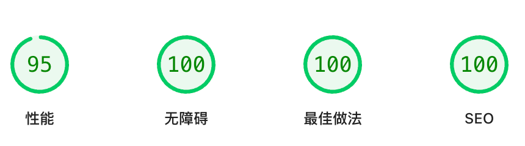
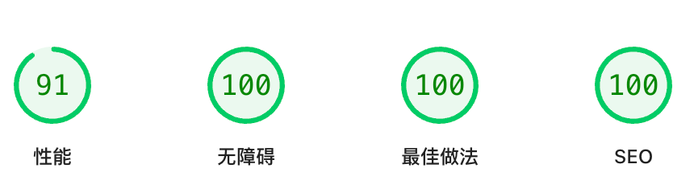

# Simple Landing Page

[English](README.md) | [中文](README_zh.md)

一个使用 **Astro 5**、**React 19** 和 **Tailwind CSS** 构建的极简个人主页和数字名片。

## ✨ 特性

- 🌍 **国际化**：中英文语言支持，采用每语言独立静态页面
- 🌙 **深色模式**：支持系统偏好检测和 localStorage 持久化的主题切换
- 📱 **响应式设计**：基于 Tailwind CSS 的移动优先设计
- 📡 **RSS 聚合**：可配置的 RSS/Atom 订阅解析器，支持 Bun 运行时
- 📧 **联系表单**：使用 EmailJS 的功能性联系表单
- 📊 **数据分析**：Google Analytics 集成（可选）
- 🚀 **性能优化**：Lighthouse 优化的静态站点生成
- 🎨 **现代 UI**：简洁专业的设计，流畅的动画和过渡效果
- ⚡ **React Islands**：基于 Astro 群岛架构的交互式组件

## 预览


## Lighthouse PageSpeed Insights

### 桌面端

[](https://pagespeed.web.dev/analysis/https-www-wenjiexu-site/b7dpi427wf?form_factor=desktop)

自行测试：[Google Lighthouse PageSpeed Insights](https://pagespeed.web.dev/analysis/https-www-wenjiexu-site/b7dpi427wf?form_factor=desktop)

### 移动端

[](https://pagespeed.web.dev/analysis/https-www-wenjiexu-site/b7dpi427wf?form_factor=mobile)

自行测试：[Google Lighthouse PageSpeed Insights](https://pagespeed.web.dev/analysis/https-www-wenjiexu-site/b7dpi427wf?form_factor=mobile)

## 项目结构

```text
src/
├── components/
│   └── astro/           # React island 组件
│       ├── About.jsx    # 关于页面组件
│       ├── Contact.jsx  # 联系页面组件
│       ├── Footer.jsx   # 页脚组件
│       ├── HeaderBar.jsx # 带导航的头部
│       ├── Home.jsx     # 首页组件
│       ├── Hero.jsx     # Hero 区块
│       ├── ThemeToggle.jsx # 主题切换器
│       ├── LanguageSwitcher.jsx # 语言切换器
│       └── ...          # 其他 UI 组件
├── data/
│   └── rss-posts.json   # 生成的 RSS 订阅数据
├── layouts/
│   └── BaseLayout.astro # 全局布局（meta、字体、GA）
├── locales/             # 国际化文件
│   ├── config.js        # 语言配置
│   ├── en.json          # 英文内容
│   └── zh.json          # 中文内容
├── pages/
│   ├── index.astro      # 根路径重定向到默认语言
│   ├── 404.astro        # 自定义 404 页面
│   ├── en/              # 英文页面
│   │   ├── index.astro
│   │   ├── about.astro
│   │   └── contact.astro
│   └── zh/              # 中文页面
│       ├── index.astro
│       ├── about.astro
│       └── contact.astro
├── styles/
│   └── global.css       # 全局样式
└── scripts/
    └── fetch-rss.bun.js # RSS 聚合脚本（Bun）
```

## 开发

### 前置要求

- [Bun](https://bun.sh/) 1.0+（推荐）
- 或 Node.js 18+

### 设置

1. **克隆并安装依赖**：

   ```bash
   git clone https://github.com/WayneXuCN/homepage.git
   cd homepage
   bun install
   ```

2. **配置环境变量**：

   基于 `.env.example` 创建 `.env` 文件：

   ```bash
   cp .env.example .env
   ```

   编辑 `.env` 添加你的配置：

   ```env
   # EmailJS（联系表单必需）
   PUBLIC_EMAILJS_SERVICE_ID=your_service_id_here
   PUBLIC_EMAILJS_TEMPLATE_ID=your_template_id_here
   PUBLIC_EMAILJS_PUBLIC_KEY=your_public_key_here

   # Google Analytics（可选）
   PUBLIC_GA_ID=G-XXXXXXXXXX
   ```

3. **运行开发服务器**：

   ```bash
   bun run dev
   ```

   打开 [http://localhost:4321](http://localhost:4321) 在浏览器中查看。

## 构建与部署

### 静态导出

项目配置为静态站点生成：

```bash
bun run build
```

静态文件将生成在 `dist/` 目录中，可以部署到任何静态托管服务（GitHub Pages、Vercel、Netlify、Cloudflare Pages 等）。

### 构建流程

构建包含自动 RSS 聚合步骤：

1. **预构建**：`bun run prebuild` 执行 `bun run scripts/fetch-rss.bun.js`
2. **RSS 抓取**：抓取配置的 RSS/Atom 订阅并生成 `src/data/rss-posts.json`
3. **静态生成**：Astro 构建包含 RSS 数据的静态站点

## 配置

### 内容管理

所有网站内容通过 `src/locales/` 中的 JSON 文件管理：

- `src/locales/zh.json` - 中文内容
- `src/locales/en.json` - 英文内容

编辑这些文件以更新：

- 文本和标签
- 导航链接
- 项目条目
- 社交链接
- SEO 元数据

### 添加新语言

1. 在 `src/locales/config.js` 中添加语言配置：

   ```js
   export const localeConfig = {
     // ... 现有语言
     ja: {
       label: '日本語',
       name: 'Japanese',
       hrefLang: 'ja',
     },
   };
   ```

2. 创建包含翻译内容的 `src/locales/ja.json`

3. 在 `src/pages/ja/` 目录下创建页面：
   - `index.astro`
   - `about.astro`
   - `contact.astro`

### RSS 配置

RSS 订阅在语言文件的 `featuredPosts.rss` 中配置：

```json
{
  "featuredPosts": {
    "rss": {
      "enabled": true,
      "feeds": [
        {
          "url": "https://your-blog.com/feed.xml",
          "parser": "jekyllFeed"
        }
      ],
      "limit": 6
    }
  }
}
```

**可用解析器**：

- `default`：标准 RSS/Atom 解析器
- `jekyllFeed`：Jekyll 生成订阅的增强解析器

### EmailJS 设置

要使联系表单工作：

1. 创建 [EmailJS](https://www.emailjs.com/) 账户
2. 设置邮件服务
3. 创建包含变量的邮件模板：`user_name`、`user_email`、`topic`、`message`
4. 使用你的 EmailJS 凭据更新环境变量

### 主题自定义

- **颜色**：修改 `tailwind.config.mjs` 中的 Tailwind 配置
- **字体**：更新 `src/layouts/BaseLayout.astro` 中的字体设置
- **深色模式**：通过 `dark:` 变体自动支持

## 可用脚本

```bash
# 开发
bun run dev              # 启动开发服务器（端口 4321）
bun run build            # 构建生产版本（包含 RSS 抓取）
bun run preview          # 预览生产构建

# RSS 管理
bun run fetch:rss        # 手动抓取 RSS 订阅

# 测试
bun run test             # 运行 Playwright 测试
bun run test:e2e         # 运行 E2E 测试（仅 Chromium）
bun run test:headed      # 以有头模式运行测试
bun run test:ui          # 运行带 UI 的测试

# 代码质量
bun run format           # 使用 Prettier 格式化代码
bun run format:check     # 检查代码格式
```

## 技术栈

- **框架**：[Astro](https://astro.build/) 5.x
- **UI 库**：[React](https://react.dev/) 19.x（Islands）
- **样式**：[Tailwind CSS](https://tailwindcss.com/) 3.x
- **运行时**：[Bun](https://bun.sh/) 1.x
- **测试**：[Playwright](https://playwright.dev/)
- **邮件**：[EmailJS](https://www.emailjs.com/)

## 贡献

1. Fork 仓库
2. 创建功能分支
3. 进行更改
4. 如需更新文档
5. 提交 Pull Request

## 许可证

本项目基于 MIT 许可证。详见 [LICENSE](LICENSE) 文件。
